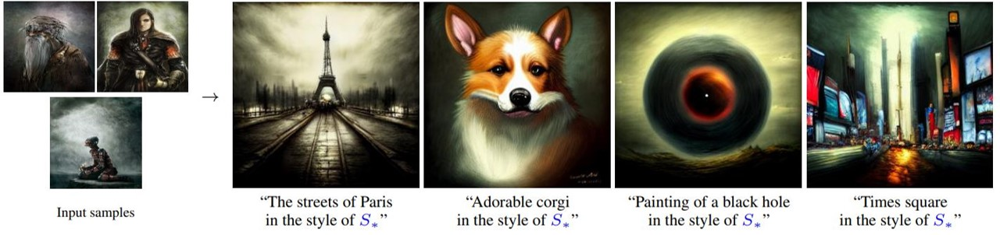

# An Image is Worth One Word: Personalizing Text-to-Image Generation using Textual Inversion

[](https://arxiv.org/abs/2208.01618)

[[Project Website](https://textual-inversion.github.io/)]

> **An Image is Worth One Word: Personalizing Text-to-Image Generation using Textual Inversion**<br>
> Rinon Gal<sup>1,2</sup>, Yuval Alaluf<sup>1</sup>, Yuval Atzmon<sup>2</sup>, Or Patashnik<sup>1</sup>, Amit H. Bermano<sup>1</sup>, Gal Chechik<sup>2</sup>, Daniel Cohen-Or<sup>1</sup> <br>
> <sup>1</sup>Tel Aviv University, <sup>2</sup>NVIDIA

>**Abstract**: <br>
> Text-to-image models offer unprecedented freedom to guide creation through natural language.
  Yet, it is unclear how such freedom can be exercised to generate images of specific unique concepts, modify their appearance, or compose them in new roles and novel scenes.
  In other words, we ask: how can we use language-guided models to turn <i>our</i> cat into a painting, or imagine a new product based on <i>our</i> favorite toy?
  Here we present a simple approach that allows such creative freedom.
  Using only 3-5 images of a user-provided concept, like an object or a style, we learn to represent it through new "words" in the embedding space of a frozen text-to-image model.
  These "words" can be composed into natural language sentences, guiding <i>personalized</i> creation in an intuitive way.
  Notably, we find evidence that a <i>single</i> word embedding is sufficient for capturing unique and varied concepts.
  We compare our approach to a wide range of baselines, and demonstrate that it can more faithfully portray the concepts across a range of applications and tasks.

## Description
This repo contains the official code, data and sample inversions for our Textual Inversion paper. 

## Updates
**29/08/2022** Merge embeddings now supports SD embeddings. Added SD pivotal tuning code (WIP), fixed training duration, checkpoint save iterations.
**21/08/2022** Code released!

## TODO:
- [x] Release code!
- [x] Optimize gradient storing / checkpointing. Memory requirements, training times reduced by ~55%
- [x] Release data sets
- [ ] Release pre-trained embeddings
- [ ] Add Stable Diffusion support

## Setup

Our code builds on, and shares requirements with [Latent Diffusion Models (LDM)](https://github.com/CompVis/latent-diffusion). To set up their environment, please run:

```
conda env create -f environment.yaml
conda activate ldm
```

You will also need the official LDM text-to-image checkpoint, available through the [LDM project page](https://github.com/CompVis/latent-diffusion). 

Currently, the model can be downloaded by running:

```
mkdir -p models/ldm/text2img-large/
wget -O models/ldm/text2img-large/model.ckpt https://ommer-lab.com/files/latent-diffusion/nitro/txt2img-f8-large/model.ckpt
```

## Usage

### Inversion

To invert an image set, run:

```
python main.py --base configs/latent-diffusion/txt2img-1p4B-finetune.yaml 
               -t 
               --actual_resume /path/to/pretrained/model.ckpt 
               -n <run_name> 
               --gpus 0, 
               --data_root /path/to/directory/with/images
               --init_word <initialization_word>
```

where the initialization word should be a single-token rough description of the object (e.g., 'toy', 'painting', 'sculpture'). If the input is comprised of more than a single token, you will be prompted to replace it.

Please note that `init_word` is *not* the placeholder string that will later represent the concept. It is only used as a beggining point for the optimization scheme.

In the paper, we use 5k training iterations. However, some concepts (particularly styles) can converge much faster.

To run on multiple GPUs, provide a comma-delimited list of GPU indices to the --gpus argument (e.g., ``--gpus 0,3,7,8``)

Embeddings and output images will be saved in the log directory.

See `configs/latent-diffusion/txt2img-1p4B-finetune.yaml` for more options, such as: changing the placeholder string which denotes the concept (defaults to "*"), changing the maximal number of training iterations, changing how often checkpoints are saved and more.

**Important** All training set images should be upright. If you are using phone captured images, check the inputs_gs*.jpg files in the output image directory and make sure they are oriented correctly. Many phones capture images with a 90 degree rotation and denote this in the image metadata. Windows parses these correctly, but PIL does not. Hence you will need to correct them manually (e.g. by pasting them into paint and re-saving) or wait until we add metadata parsing.

### Generation

To generate new images of the learned concept, run:
```
python scripts/txt2img.py --ddim_eta 0.0 
                          --n_samples 8 
                          --n_iter 2 
                          --scale 10.0 
                          --ddim_steps 50 
                          --embedding_path /path/to/logs/trained_model/checkpoints/embeddings_gs-5049.pt 
                          --ckpt_path /path/to/pretrained/model.ckpt 
                          --prompt "a photo of *"
```

where * is the placeholder string used during inversion.

### Merging Checkpoints

LDM embedding checkpoints can be merged into a single file by running:

```
python merge_embeddings.py 
--manager_ckpts /path/to/first/embedding.pt /path/to/second/embedding.pt [...]
--output_path /path/to/output/embedding.pt
```

For SD embeddings, simply add the flag: `-sd` or `--stable_diffusion`.

If the checkpoints contain conflicting placeholder strings, you will be prompted to select new placeholders. The merged checkpoint can later be used to prompt multiple concepts at once ("A photo of * in the style of @").

### Pretrained Models / Data

Datasets which appear in the paper are being uploaded [here](https://drive.google.com/drive/folders/1d2UXkX0GWM-4qUwThjNhFIPP7S6WUbQJ). Some sets are unavailable due to image ownership. We will upload more as we recieve permissions to do so.

Pretained models coming soon.

## Stable Diffusion

Stable Diffusion support is a work in progress and will be completed soon™.

## Tips and Tricks
- Adding "a photo of" to the prompt usually results in better target consistency.
- Results can be seed sensititve. If you're unsatisfied with the model, try re-inverting with a new seed (by adding `--seed <#>` to the prompt).


## Citation

If you make use of our work, please cite our paper:

```
@misc{gal2022textual,
      doi = {10.48550/ARXIV.2208.01618},
      url = {https://arxiv.org/abs/2208.01618},
      author = {Gal, Rinon and Alaluf, Yuval and Atzmon, Yuval and Patashnik, Or and Bermano, Amit H. and Chechik, Gal and Cohen-Or, Daniel},
      title = {An Image is Worth One Word: Personalizing Text-to-Image Generation using Textual Inversion},
      publisher = {arXiv},
      year = {2022},
      primaryClass={cs.CV}
}
```

## Results
Here are some sample results. Please visit our [project page](https://textual-inversion.github.io/) or read our paper for more!


